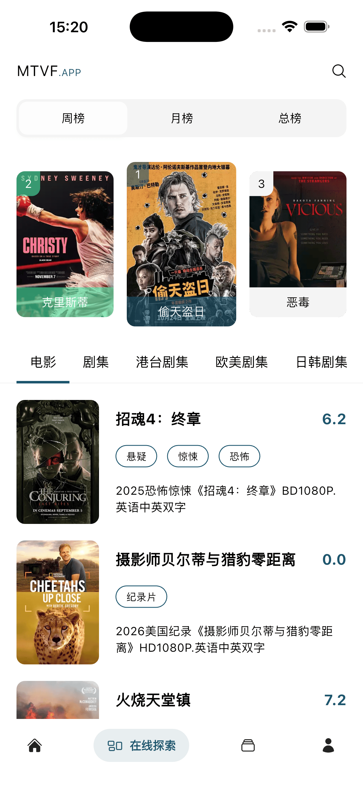
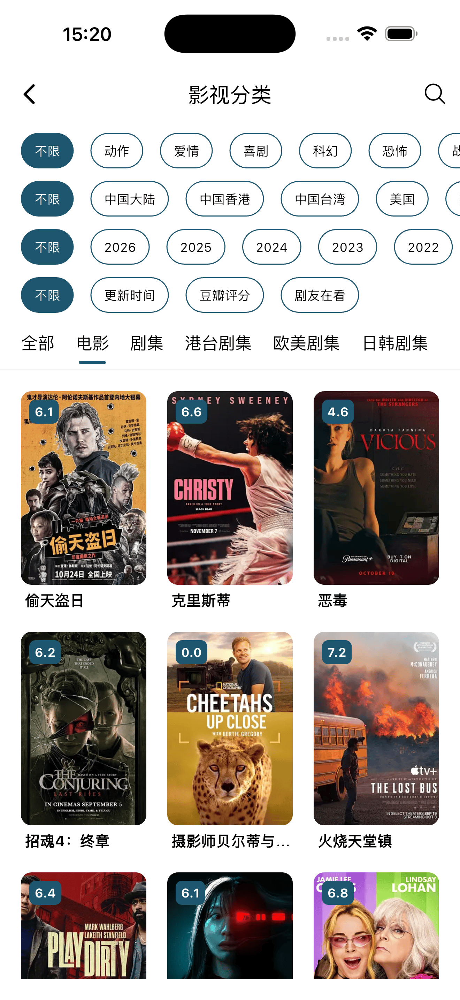
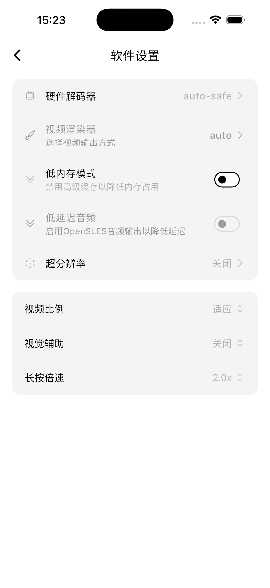

<h1 align="center">MTVF</h1>

一款基于 Flutter 开发的影视资源阅览与播放应用，支持用户登录注册、影视收藏等功能，为用户提供便捷的影视观看体验。本应用所有资源均收集于互联网，仅用于学习交流，非盈利用途。如有侵权或商务合作需求，请及时与我联系。

## 支持平台

- Android
- iOS（需要自签名）
- MacOS（待支持）
- Windows（待支持）
- Linux（待支持）

## 屏幕截图

<table border="1" cellpadding="8" cellspacing="0" width="100%">
  <tr>
    <td></td>
    <td></td>
    <td></td>
  </tr>
  <tr>
    <td></td>
    <td></td>
    <td></td>
  </tr>
</table>

## 功能/开发计划

- [✓] 资源探索
- [✓] 资源筛选
- [✓] 资源搜索
- [✓] 视频播放
- [✓] 播放设置
- [✓] 播放进度
- [✓] 超分辨率
- [✓] 视觉辅助
- [✗] 弹幕系统
- [✗] 评论系统
- [✗] 资源收藏
- [✓] 浏览历史
- [✗] 消息通知
- [✗] 影视清单
- [✗] 敬请期待

## 下载
通过本页面右侧[release](https://github.com/SX-Code/mtvf/releases)下载

## 声明

1、本项目仅为技术学习与交流使用，所有影视资源均收集自互联网公开渠道，非商用、非盈利。

2、项目开发者不对任何资源的版权、真实性、完整性、安全性负责，资源版权均归原作者或权利人所有。

3、若您认为本项目中某些内容侵犯了您的合法权益，请通过 Issues 或邮箱联系，我将在核实后立即删除相关内容。

4、使用者在下载、观看、传播相关内容时，请自行遵守当地法律法规，由此产生的任何法律责任由使用者自行承担，与本项目及开发者无关。

5、本项目仅提供资源阅览与播放演示，不提供存储、上传、分发服务。

## 隐私政策

本应用在未登录状态下不会收集任何用户信息。登录后仅为实现身份验证收集设备 ID，并记录您的播放进度等个人使用数据，所有信息仅用于提供对应账号服务，不会向第三方共享或用于其他用途。

## 致谢

- 感谢 [Dart](https://dart.dev/) 与 [Flutter](https://flutter.dev/) 为本项目提供坚实的技术基石。
- 感谢 [Dio](https://github.com/cfug/dio/blob/main/dio) 提供高效可靠的网络请求支持。
- 感谢 [media-kit](https://github.com/media-kit/media-kit) 提供强大的视频播放能力。
- 感谢 [canvas_danmaku](https://github.com/Predidit/canvas_danmaku) 提供流畅的弹幕渲染支持。
- 感谢 [cached_network_image](https://github.com/Baseflow/flutter_cached_network_image) 提供高效的图片缓存与加载支持。
- 感谢 [Anime4K](https://github.com/bloc97/Anime4K) 与 [mpv_PlayKit](https://github.com/hooke007/mpv_PlayKit) 两个优秀开源项目，为本软件提供了视频超分能力支持，使影视播放画质与体验得以大幅提升。